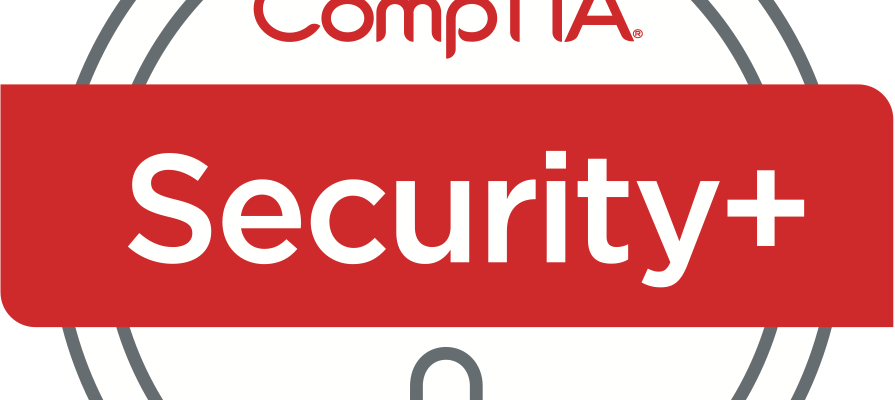

# CompTIA Security+ (SY0-501) Cheatsheet

"The CompTIA Security+ exam will the successful candidate has the knowldege and skills required to install and configure systems to secure applications, networks, and devices; perform threat analysis and respond with appropriate mitigation techniques; participlate in risk mitigation activities; and operate with an awareness of applicable policies, laws and regulations.

The successful candidate will perform these tasks to support the principles of confidentiality, integrity, and availability."

All the cheat sheet will be divided into the given exam domain of SY0-501. For accessing the cheat sheet click on the interested domain.

**Note**: Cheat Sheets contains the condensed format of the main facts which are important for the exam.

## Domains

+ [D1: Threats, Attacks & Vulnerabilities (21%)](https://github.com/OddExtension5/CompTIA-Security-Cheatsheet/blob/master/D1.md)
+ [D2: Technologies & Tools (22%)](https://github.com/OddExtension5/CompTIA-Security-Cheatsheet/blob/master/D2.md)
+ [D3: Architecture & Design (15%)](https://github.com/OddExtension5/CompTIA-Security-Cheatsheet/blob/master/D3.md)
+ [D4: Identify & Access Management (16%)](https://github.com/OddExtension5/CompTIA-Security-Cheatsheet/blob/master/D3.md)
+ D5: Risk Management (14%)
+ D6: Cryptography & PKI (12%)

## References

+ [CompTIA Security+ SY0-501 Certification Crash Course](https://learning.oreilly.com/live-training/courses/comptia-security-sy0-501-certification-crash-course/0636920400424/)
+ [CompTIA Security+ All-in-One Exam Guide, Fifth Edition (Exam SY0-501), 5th Edition](https://learning.oreilly.com/library/view/comptia-security-all-in-one/9781260019292/)

